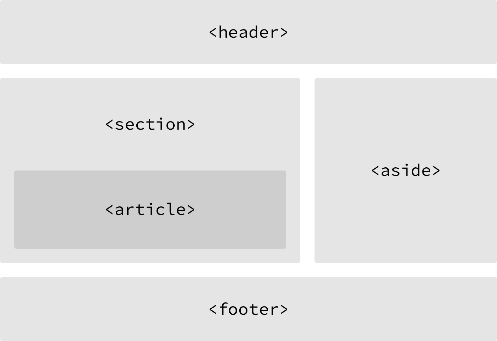

## HTML 요소는 non-semantic 요소, semantic 요소로 구분할 수 있다.
### non-semantic 요소
div, span 등이 있으며 이들 태그는 content에 대하여 어떤 설명도 하지 않는다.

 

### semantic 요소
form, table, img 등이 있으며 이들 태그는 content의 의미를 명확히 설명한다,
다음은 HTML5에서 새롭게 추가된 시맨틱 태그이다.

 

### tags
|tag|Description|
|---|---|
|header|헤더 영역|
|nav|내비게이션 영역|
|aside|사이드에 위치하는 공간|
|section|본문의 여러 내용(article)을 포함하는 공간|
|article|분문의 주내용이 들어가는 공간|
|footer|푸터 영역|

 

