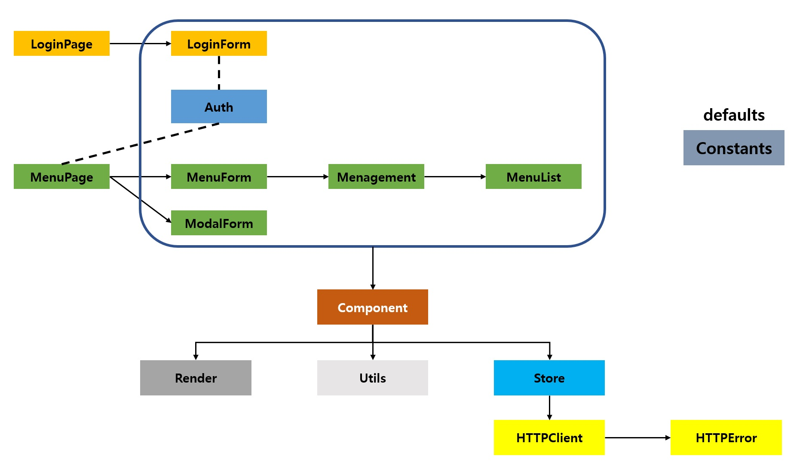

# 대상
## [redux 해체해보기](https://github.com/ellbee/redux/blob/c2bf13c2c20adbeacd631dee4f01db29f8856052/src/utils/combineReducers.js)
### [+ redux-saga 해체해보기](https://github.com/quicksnap/redux-saga/tree/72a21b270fd966b5ba3115cade654135c3cf3215)

 

## [vuex 해체해보기](https://github.com/azamat-sharapov/vuex/tree/dfcbbe76ecf24af4ba78af5de80d7ea104bf1fe7)

 

# UML

 

 
