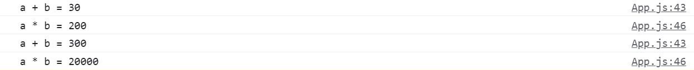
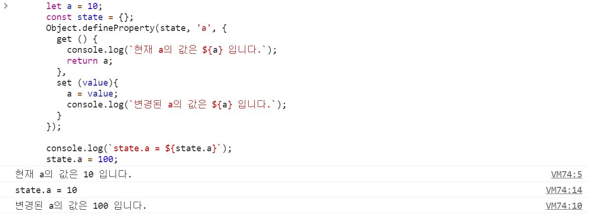

> 첫 번째 커밋때 추가한 부분

### 1. 상태를 관리해보자.
- 중앙 집중식 저장소로 컴포넌트와의 관계를 맺고 제어해보자.
- Vue, React 같은 프레임워크의 목적 중 하나는 **상태를 기반으로 DOM을 렌더링하는 것**이기 때문이다.

<br>

### 2. 관찰자 패턴(Observer Pattern)에 대해 이해하자. 우선 관계를 살펴볼까?
> 중앙 집중식 저장소를 `Store`라고 한다면 이를 구현하기 위해서는 저장소(Store)와 컴포넌트(Component)의 관계를 아래와 같이 명확히 한다.
- Store는 여러 컴포넌트에서 사용할 수 있다.
- Store가 변경될 때, Store가 사용되고 있는 Component도 변경되어야 한다.

<br>

### 3. 2번을 의사코드로 표현하자면 아래와 같다.
```js
// Store 생성
const store = new Store({a: 10, b: 20});

// Component 생성
const componentA = new Component(() => console.log(a + b););
const componentB = new Component(() => console.log(a * b););

// Component가 Store를 구독한다.
component1.subscribe(store);
component2.subscribe(store);

// store의 state를 변경한다.
store.setState({a: 100, b: 200});

// store가 변경되었음을 알린다.
store.notify();
```
  - 순서대로 따라가보자. 처음 componentA는 a + b = 30을 출력하고, componentB는 a * b = 200을 출력한다.
  - store의 값이 변경되면 a + b = 300, a * b = 20000을 각각 출력한다.

<br>

### 4. 3번과 같이 작성되는 패턴을 관찰자 패턴(Observer Pattern)이라고 한다.
> 객체의 상태 변화를 관찰하는 관찰자들, 옵저버들의 목록을 객체에 등록하여 **상태 변화가 있을 때마다 메서드 등을 통해 겍체가 직접 목록의 각 옵저버에게 통지하도록 하는 디자인 패턴**이다.
- 주로 **분산 이벤트 핸들링 시스템**을 구현하는데 사용된다.
- **발행/구독 모델(Publish/Subscribe Model)** 로도 알려져 있다.

<br>

### 5. 발행기관을 작성한다.
```js
class Publish {
  constructor(state) {
    this._state = state;
    this._observers = new Set();
    Object.keys(state).forEach(key =>
      Object.defineProperty(this, key, {
        get: () => this._state[key],
      }),
    );
  }

  setState(newState) {
    this._state = { ...this._state, ...newState };
    this.notification();
  }

  subscribe(newUser) {
    this._observers.add(newUser);
  }

  notification() {
    this._observers.forEach(fn => fn());
  }
}
```
- 핵심 내용은 **내부에 변화가 생길 경우 구독자에게 알리는 것**. 이 메서드다.
  ```js
  setState(newState) {
    this._state = { ...this._state, ...newState };
    this.notification();
  }
  ```

<br>

### 6. 발행기관을 구독할 구독자를 작성한다.
```js
class Subscriber {
  constructor(work) {
    this._fn = work;
  }

  subscribe(publisher) {
    publisher.subscribe(this._fn);
  }
}
```
- 구독자는 **발행기관에서 변화가 생겼을 때 하는 일을 정의**하고, 발행기관을 **구독**한다.

<br>

### 7. 확인해보자.
```js
(function () {
  const state = new Publish({
    a: 10,
    b: 20,
  });

  const 덧셈계산기 = new Subscriber(() =>
    console.log(`a + b = ${state.a + state.b}`),
  );
  const 곱셈계산기 = new Subscriber(() =>
    console.log(`a * b = ${state.a * state.b}`),
  );

  덧셈계산기.subscribe(state);
  곱셈계산기.subscribe(state);

  state.notification();
  // a + b = 30
  // a * b = 200

  state.setState({ a: 100, b: 200 });
})();
```
- 결과

<br>

<div align='center'>



</div>

<br>

- 지금은 `2명의 구독자가 1개의 발행기관을 구독하고 있는 상황`인데, 만약 **10명의 구독자가 100개의 발행기관을 구독**한다면 관련 코드가 기하급수적으로 늘어나는 문제가 있다.
    
<br>

> 두 번째 커밋때 추가한 부분

### 8. 위의 코드들을 observable과 observe라는 관계로 만들 것이다.
```js
const state = observable({ a: 10, b: 20 });
observe(() => console.log(`a = ${state.a}`));
observe(() => console.log(`b = ${state.b}`));
observe(() => console.log(`a + b = ${state.a} + ${state.b}`));
observe(() => console.log(`a * b = ${state.a} + ${state.b}`));
observe(() => console.log(`a - b = ${state.a} + ${state.b}`));

state.a = 100;
state.b = 200;
```
- observable은 observe에서 사용된다.
- observable에 변화가 생기면, observe에 등록된 함수가 실행된다.
- 논리는 명확하다. 그럼 어떻게 구현해야 할까?

<br>

### 9. [Object.defineProperty](https://developer.mozilla.org/ko/docs/Web/JavaScript/Reference/Global_Objects/Object/defineProperty)이라는 API가 존재한다.
- MDN 문서에 설명되어 있는 말은 `Object.defineProperty() 정적 메서드는 객체에 새로운 속성을 직접 정의하거나 이미 존재하는 속성을 수정한 후, 해당 객체를 반환합니다.` 이다.
- 그렇다면? 특정 객체를 수정할 때마다 반환 값이 존재하니 React의 setState처럼 사용할 수 있지 않을까?

  ```js
  let a = 10;
  const state = {};
  Object.defineProperty(state, 'a', {
    get () {
      console.log(`현재 a의 값은 ${a} 입니다.`);
      return a;
    },
    set (value){
      a = value;
      console.log(`변경된 a의 값은 ${a} 입니다.`);
    }
  });

  console.log(`state.a = ${state.a}`);
  state.a = 100;
  ```

- 결과

  <br>

  <div align='center'>

  

  </div>

  <br>

<br>

### 10. 아주 명확하다! 해당 함수에 대해 자세히 언급하자면 이렇다.
- 정의 : `Object.defineProperty(object, prop, descriptor)`
  - **object** : 속성을 정의할 객체
  - **prop** : 새로 정의하거나 수정하려는 속성의 이름 또는 Symbol
  - **descriptor** : 새로 정의하거나 수정하려는 속성을 기술하는 객체
- 즉, 객체에 변화가 생기거나 무언가 참조할 경우 우리가 원하는 특정 행위를 중간에 기술할 수 있다.
- 복수의 프로퍼티를 동시에 선언하고 싶다면 `Object.defineProperties(object, props)`를 사용하자.

<br>

### 11.  그럼 여러 속성을 관리하려면 어떻게 확장해야 할까?
> 고정된 프로퍼티라면 `Object.defineProperties`를 사용해 선언할 수 있지만, 동적으로 관리되는 경우가 많으니 반복문을 활용한다.
  ```js
  const state = {
    a: 10,
    b: 20,
  };

  const stateKeys = Object.keys(state);

  for (const key of stateKeys) {
    let _value = state[key];
    Object.defineProperty(state, key, {
      get () {
        console.log(`현재 state.${key}의 값은 ${_value} 입니다.`);
        return _value;
      },
      set (value) {
        _value = value;
        console.log(`변경된 state.${key}의 값은 ${_value} 입니다.`);
      }
    })
  }

  console.log(`a + b = ${state.a + state.b}`);

  state.a = 100;
  state.b = 200;
  ```

<br>

### 12. 형태가 보이기 시작한다.
> console.log 부분을 observer 함수로 대체하자.

```js
const state = {
  a: 10,
  b: 20,
};

const stateKeys = Object.keys(state);
const observer = () => console.log(`a + b = ${state.a + state.b}`);

for (const key of stateKeys) {
  let _value = state[key];
  Object.defineProperty(state, key, {
    get () {
      return _value;
    },
    set (value) {
      _value = value;
      observer();
    }
  })
}

observer();

state.a = 100;
state.b = 200;
```

<br>

### 13. 함수가 대체되는 것을 확인했다.
> 그럼 이제 확장해보자.

```js
const state = { a: 10, b: 20 };
const stateKeys = Object.keys(state);
let currentObserver = null;
for (const _key of stateKeys) {
  let _value = state[_key];
  const observers = new Set();
  Object.defineProperty(state, _key, {
    get() {
      if (currentObserver) observers.add(currentObserver);
      console.log(observers);
      return _value;
    },
    set(value) {
      _value = value;
      observers.forEach(observer => observer());
    },
  });
}

const plusCalculator = () => {
  currentObserver = plusCalculator;
  console.log(`state a + b : ${state.a + state.b}`);
};

const subtractCalculator = () => {
  currentObserver = subtractCalculator;
  console.log(`state a - b : ${state.a - state.b}`);
};

plusCalculator();
subtractCalculator();

state.a = 1000;
state.b = 50000;
```
- 이 코드의 핵심은 함수가 실행될 때 currentObsever가 실행중인 함수를 참조하도록 만든 것이다.
  - state의 property가 사용될 때(get 메서드가 실행될 때) currentObserver를 observers에 등록한다.
  - state의 property가 변경될 때(set 메서드가 실행될 때) observers에 등록된 모든 observer를 실행한다.

<br>

### 14. 위 코드를 재사용해야 하니 함수로 만들어보자. 
```js
let currentObserver = null;

const observe = fn => {
  currentObserver = fn;
  fn();
  currentObserver = null;
};

const observable = obj => {
  const keys = Object.keys(obj);

  keys.forEach(key => {
    let _value = obj[key];
    let observers = new Set();
    Object.defineProperty(obj, key, {
      get() {
        if (currentObserver) observers.add(currentObserver);
        return _value;
      },
      set(value) {
        _value = value;
        observers.forEach(fn => fn());
      },
    });
  });

  return obj;
};

const state = observable({ a: 10, b: 20 });
observe(() => console.log(`a = ${state.a}`));
observe(() => console.log(`b = ${state.b}`));
observe(() => console.log(`a + b = ${state.a} + ${state.b}`));
observe(() => console.log(`a * b = ${state.a} + ${state.b}`));
observe(() => console.log(`a - b = ${state.a} + ${state.b}`));

state.a = 100;
state.b = 200;
```

<br>

> 세 번째 커밋때 추가한 부분

### 15. DOM에 적용하기
> DOM(Component)에 적용한다.

- 구조에 대한 생각은 접어두고, 기능만 구현한다.

<br>

> 네 번째 커밋때 추가한 부분

### 16. DOM을 Component로 추상화하기
> [`implements-01`](https://github.com/InSeong-So/JS-Implement/tree/master/implements-01)을 참고한다.

- 단, 컴포넌트를 생성할 때 옵저버를 참고하도록 설계한다.
  - 중요한 부분은 setup(), 최초로 생성될 때 state를 관리하도록 옵저버를 설정하는 것이다.
    ```js
    setup() {
      this._state = observable(this.initState());
      observe(() => {
        this.render();
        this.setEvent();
        this.mounted();
      });
    }
    ```

- 구현하고보니... [`implements-01`](https://github.com/InSeong-So/JS-Implement/tree/master/implements-01)의 setState()와 동일하게 작동하는것 같은데?
  - 맞다! setState도 state가 변경될 때 render가 실행되니까.
    ```js
    setState(newState) {
      this.state = { ...this.state, ...newState }
      this.render();
    }

    render () {
      this.innerHTML = this.template();
    }
    ```
  - observer는 컴포넌트 상태에 사용하는 것보다 **중앙 집중식 저장소를 관리할 때 효과적**이다. 그럼 어떻게 중앙 집중식 저장소를 생성할까?

- 우선 컴포넌트 외부에 상태를 만들어야 한다. 간단하게 Store를 생성하고 관리하자.
  > 현재까지 만들고 동작은 되는데, 아래의 상황에서 에러가 난다. 에러 로그는 나오지 않지만...
  > 1. 숫자가 아닌 문자가 들어간 경우
  > 2. 0이 앞에 붙은 경우

  - 만약 컴포넌트가 이렇게 소수가 아니라 여러 개였다면? 혹은 복잡한 컴포넌트였다면? 위의 형태는 store를 세 개의 컴포넌트가 참조하므로 store가 변경되었을 때 자동으로 렌더링 되게 작성한 것이다.
  - 여기서 Flux 패턴을 이식하면 Redux/Vuex가 된다.

- Flux는 단방향 데이터 흐름이 가장 큰 특징이다. `Dispatcher - Store - View - Action - Dispatcher`. [정리](https://github.com/InSeong-So/IT-Note/tree/master/chapter01-%EA%B0%9C%EB%B0%9C%EC%83%81%EC%8B%9D#book-flux-%ED%8C%A8%ED%84%B4%EC%9D%80-%EB%AC%B4%EC%97%87%EC%9D%B8%EA%B0%80%EC%9A%94)를 참조하자.

<br>

> 다섯 번째 커밋때 추가한 부분

### 17. Redux 만들기
> redux는 불변성을 중시하므로 옵저버 기능은 맞지 않긴 하다.

- redux 공식 문서의 [코드 가이드](https://ko.redux.js.org/introduction/getting-started/)
    ```js
    import { createStore } from 'redux'

    /**
    * 이것이 (state, action) => state 형태의 순수 함수인 리듀서입니다.
    * 리듀서는 액션이 어떻게 상태를 다음 상태로 변경하는지 서술합니다.
    *
    * 상태의 모양은 당신 마음대로입니다: 기본형(primitive)일수도, 배열일수도, 객체일수도,
    * 심지어 Immutable.js 자료구조일수도 있습니다.  오직 중요한 점은 상태 객체를 변경해서는 안되며,
    * 상태가 바뀐다면 새로운 객체를 반환해야 한다는 것입니다.
    *
    * 이 예제에서 우리는 `switch` 구문과 문자열을 썼지만,
    * 여러분의 프로젝트에 맞게
    * (함수 맵 같은) 다른 컨벤션을 따르셔도 좋습니다.
    */
    function counter(state = 0, action) {
      switch (action.type) {
        case 'INCREMENT':
          return state + 1
        case 'DECREMENT':
          return state - 1
        default:
          return state
      }
    }

    // 앱의 상태를 보관하는 Redux 저장소를 만듭니다.
    // API로는 { subscribe, dispatch, getState }가 있습니다.
    let store = createStore(counter)

    // subscribe()를 이용해 상태 변화에 따라 UI가 변경되게 할 수 있습니다.
    // 보통은 subscribe()를 직접 사용하기보다는 뷰 바인딩 라이브러리(예를 들어 React Redux)를 사용합니다.
    // 하지만 현재 상태를 localStorage에 영속적으로 저장할 때도 편리합니다.

    store.subscribe(() => console.log(store.getState()))

    // 내부 상태를 변경하는 유일한 방법은 액션을 보내는 것뿐입니다.
    // 액션은 직렬화할수도, 로깅할수도, 저장할수도 있으며 나중에 재실행할수도 있습니다.
    store.dispatch({ type: 'INCREMENT' })
    // 1
    store.dispatch({ type: 'INCREMENT' })
    // 2
    store.dispatch({ type: 'DECREMENT' })
    // 1
    ```
    - createStore가 반환하는 것은 subscribe, dispatch, getState 등의 메소드를 가진 객체이다.
        ```js
        const createStore = (reducer) => {
          // ...
          return { subscribe, dispatch, getState };
        }
        ```
    - 인터페이스를 알았으니 구현을 시작해보자.

- `scr/core/store.js`
    ```js
    import { observable } from './observer.js';

    export const createStore = (reducer) => {
      
      // reducer가 실행될 때 반환하는 객체(state)를 observable로 만든다.
      const state = observable(reducer());
      
      // getState는 실 state가 아닌 getter만 존재하는 사본 state를 반환한다.
      const closneState = {};
      Object.keys(state).forEach(key => {
        Object.defineProperty(closneState, key, {
          get: () => state[key],
        })
      });
      
      // dispatch로만 state의 값을 변경한다.
      const dispatch = (action) => {
        const newState = reducer(state, action);

        for (const [key, value] of Object.entries(newState)) {
          // state의 key가 아닐 경우 생략 
          if ((state[key] ?? false)) continue;
          state[key] = value;
        }
      }

      const getState = () => closneState;
      
      // subscribe는 observe로 대체
      return { getState, dispatch };

    }
    ```

- 생성된 createStore로 `src/store.js`를 만든다.
    ```js
    import {createStore} from './core/Store.js';

    // 초기 state의 값 정의
    const initialState = {
      a: 10,
      b: 20,
    };

    // dispatch에서 사용될 type 정의
    export const SET_A = 'SET_A';
    export const SET_B = 'SET_B';

    // reducer를 정의하여 store에 인자로 넘긴다.
    export const store = createStore((state = initialState, action = {}) => {
      // 불변성을 지키면서 객체 변경
      switch (action.type) {
        case SET_A :
          return { ...state, a: action.payload }
        case SET_B :
          return { ...state, b: action.payload }
        default:
          return state;
      }
    });

    // reducer에서 사용될 action을 정의, ActionCreator
    export const setA = (payload) => ({ type: SET_A, payload });
    export const setB = (payload) => ({ type: SET_B, payload });
    ```

- App.js가 사용하도록 정의 `src/App.js`
    ```js
    import { Component } from './core/Component.js';
    import { setA, setB, store } from './store.js';

    const InputA = () => {
      return `<input id="stateA" value="${store.getState().a}" size="5" />`;
    };

    const InputB = () => {
      return `<input id="stateB" value="${store.getState().b}" size="5" />`;
    };

    const Calculator = () => {
      return `<p>a + b = ${store.getState().a + store.getState().b}</p>`;
    };
    export class App extends Component {
      template() {
        return `
          ${InputA()}
          ${InputB()}
          ${Calculator()}
        `;
      }

      setEvent() {
        const { $el } = this;
        // commit을 통해서 값 변경
        $el.querySelector('#stateA').addEventListener('change', ({ target }) => {
          store.dispatch(setA(Number(target.value)));
        });

        $el.querySelector('#stateB').addEventListener('change', ({ target }) => {
          store.dispatch(setB(Number(target.value)));
        });
      }
    }
    ```

<br>

> 여섯 번째 커밋때 추가한 부분

### 18. 최적화하기
1. 변경된 상태가 이전 상태와 동일한 경우 : 다시 렌더링 되지 않도록 방어해야 한다.
   - `src/core/observer.js`를 수정한다.

2. 상태가 연속으로 변경되는 경우 : 브라우저가 DOM으로 렌더링 된다면 많은 부하가 걸리므로 `requestAnimationFrame`과 `debounce`를 이용해 한 프레임에 한 번만 렌더링 되도록 만들어준다. [참고](https://developer.mozilla.org/ko/docs/Web/API/Window/requestAnimationFrame)
    > requestAnimationFrame은 1프레임에 1회 호출된다. 보통 1초에 60프레임이고, 1프레임은 약 16ms 정도이다.

   - debounce 구현하기
       ```js
       const debounceFrame = (callback) => {
         let currentCallback = -1;
         return () => {
           cancelAnimationFrame(currentCallback); // 현재 등록된 callback이 있을 경우 취소
           currentCallback = requestAnimationFrame(callback); // 1프레임 뒤에 실행
         }
       };

       debounceFrame(() => console.log(1));
       debounceFrame(() => console.log(2));
       debounceFrame(() => console.log(3));
       debounceFrame(() => console.log(4));
       debounceFrame(() => console.log(5)); // 실행
       ```
   - observer에 이식한다.
      ```js
      export const observe = fn => {
        currentObserver = debouneFrame(fn);
        fn();
        currentObserver = null;
      };
      ```

3. Proxy 사용하기
> 최신 브라우저는 [Proxy](https://developer.mozilla.org/ko/docs/Web/JavaScript/Reference/Global_Objects/Proxy)를 이용해 더욱 효과적으로 Observable을 구현할 수 있다.
  ```js
  export const observable = obj => {
    
    const observerMap = {};

    return new Proxy(obj, {
      get (target, name) {
        observerMap[name] = observerMap[name] || new Set();
        if (currentObserver) observerMap[name].add(currentObserver)
        return target[name];
      },
      set (target, name, value) {
        if (target[name] === value) return true;
        if (JSON.stringify(target[name]) === JSON.stringify(value)) return true;
        target[name] = value;
        observerMap[name].forEach(fn => fn());
        return true;
      },
    });
  }
  ```